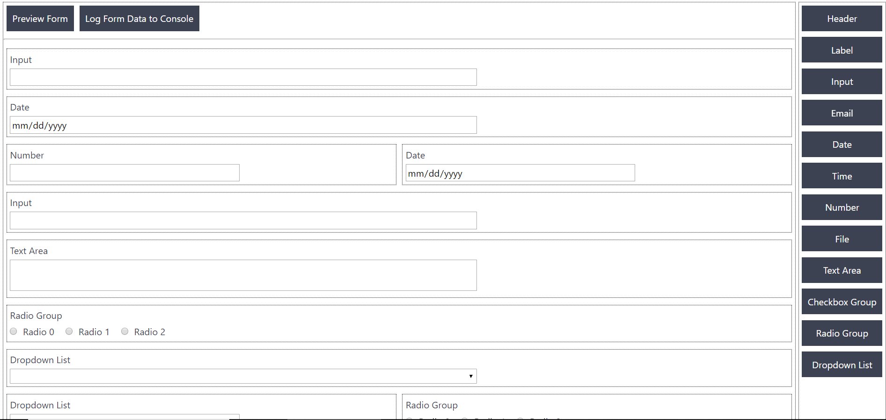
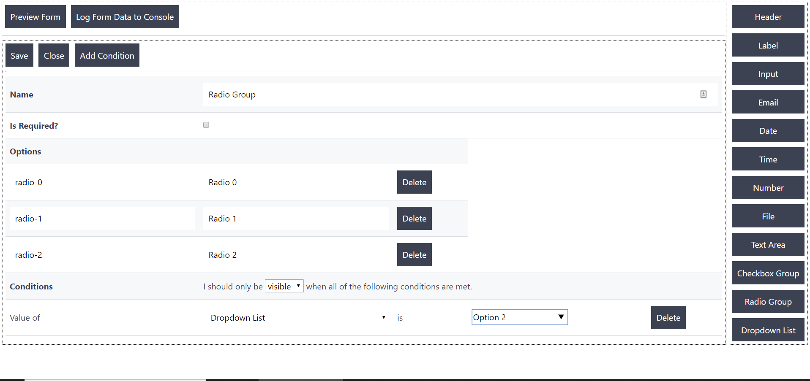

# Simple Form Builder

Minimalistic form builder library using vanilla javascript. [Click here to see the form builder in action](http://formbuilder.stackpond.com/)

# Usage

1. Drag from left to right to add form element
2. Drag from right to left to remove the form element
3. Double click (if using desktop) or tap (if using mobile) to configure element. Don't forget to 'Save' before 'Close'.
4. If you refresh the page, data goes away as I don't have any storage support in place right now.
5. The form builder is live preview so you can right away play with the conditionals.

# Build

### Run demo locally

npm run dev

### Build app for distribution

npm run build-demo 

### Build library for distribution

npm run build 
